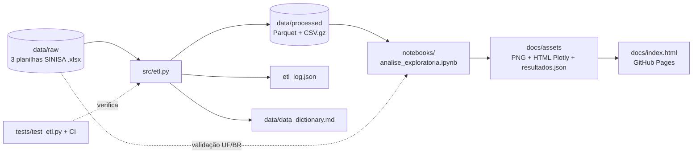
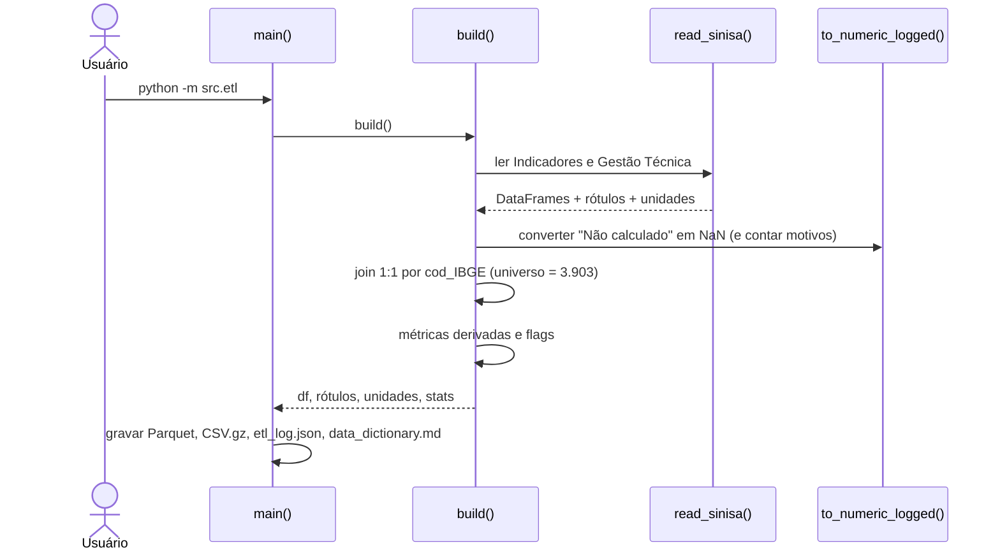
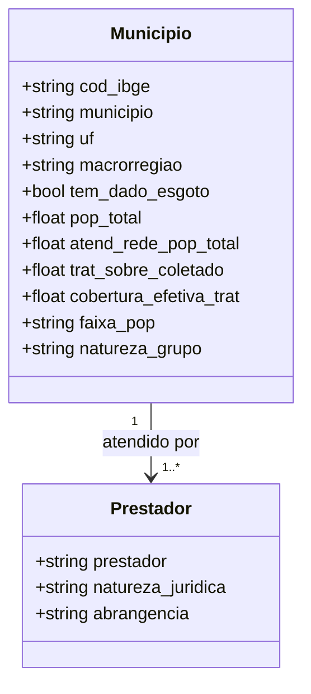

# Diagramas UML (Mermaid — renderizam direto no GitHub)

## 1. Componentes e fluxo de dados

```mermaid
flowchart LR
    RAW[("data/raw<br/>3 planilhas SINISA .xlsx")] --> ETL["src/etl.py"]
    ETL --> PROC[("data/processed<br/>Parquet + CSV.gz")]
    ETL --> LOG["etl_log.json"]
    ETL --> DIC["data/data_dictionary.md"]
    PROC --> NB["notebooks/<br/>analise_exploratoria.ipynb"]
    RAW -. validação UF/BR .-> NB
    NB --> ASSETS["docs/assets<br/>PNG + HTML Plotly + resultados.json"]
    ASSETS --> SITE["docs/index.html<br/>GitHub Pages"]
    TESTS["tests/test_etl.py + CI"] -. verifica .-> ETL
```

## 2. Sequência da execução de `python -m src.etl`

```mermaid
sequenceDiagram
    actor U as Usuário
    participant M as main()
    participant B as build()
    participant R as read_sinisa()
    participant N as to_numeric_logged()
    U->>M: python -m src.etl
    M->>B: build()
    B->>R: ler Indicadores e Gestão Técnica
    R-->>B: DataFrames + rótulos + unidades
    B->>N: converter "Não calculado" em NaN (e contar motivos)
    B->>B: join 1:1 por cod_IBGE (universo = 3.903)
    B->>B: métricas derivadas e flags
    B-->>M: df, rótulos, unidades, stats
    M->>M: gravar Parquet, CSV.gz, etl_log.json, data_dictionary.md
```

## 3. Modelo de dados (1 linha = 1 município)

```mermaid
classDiagram
    class Municipio {
        +string cod_ibge
        +string municipio
        +string uf
        +string macrorregiao
        +bool tem_dado_esgoto
        +float pop_total
        +float atend_rede_pop_total
        +float trat_sobre_coletado
        +float cobertura_efetiva_trat
        +string faixa_pop
        +string natureza_grupo
    }
    class Prestador {
        +string prestador
        +string natureza_juridica
        +string abrangencia
    }
    Municipio "1" --> "1..*" Prestador : atendido por
```
